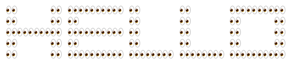

# Meta Emoji (Metamoji)

A script that templates words using Slack / Discord style emotes

## Usage
`python main.py HELLO eyes`

```
:eyes::transparent::transparent::transparent::eyes:   :eyes::eyes::eyes::eyes::eyes:  :eyes::transparent::transparent::transparent:   :eyes::transparent::transparent::transparent:   :eyes::eyes::eyes::eyes::eyes:
:eyes::transparent::transparent::transparent::eyes:   :eyes::transparent::transparent::transparent::transparent:   :eyes::transparent::transparent::transparent:   :eyes::transparent::transparent::transparent:   :eyes::transparent::transparent::transparent::eyes:   
:eyes::eyes::eyes::eyes::eyes:   :eyes::eyes::eyes::eyes::eyes:   :eyes::transparent::transparent::transparent:   :eyes::transparent::transparent::transparent:   :eyes::transparent::transparent::transparent::eyes:   
:eyes::transparent::transparent::transparent::eyes:   :eyes::transparent::transparent::transparent::transparent:   :eyes::transparent::transparent::transparent:   :eyes::transparent::transparent::transparent:   :eyes::transparent::transparent::transparent::eyes:   
:eyes::transparent::transparent::transparent::eyes:   :eyes::eyes::eyes::eyes::eyes:   :eyes::eyes::eyes::eyes:   :eyes::eyes::eyes::eyes:   :eyes::eyes::eyes::eyes::eyes:    
```
Rendered in Slack



## Credits
Inspired by Jasmine Sun who spelled `LOL` using slack emojis

