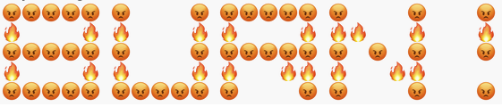

# Meta Emoji (Metamoji)

A script that templates words using Slack / Discord style emotes

## Usage
The default emoji is set to 👀

```
$ python main.py HI

:eyes::void::void::void::eyes:   :eyes::eyes::eyes::eyes::eyes:   
:eyes::void::void::void::eyes:   :void::void::eyes::void::void:   
:eyes::eyes::eyes::eyes::eyes:   :void::void::eyes::void::void:   
:eyes::void::void::void::eyes:   :void::void::eyes::void::void:   
:eyes::void::void::void::eyes:   :eyes::eyes::eyes::eyes::eyes: 
```


The `--emotes` flag takes a list of emojis and will alternate in a cycle
```
$ python main.py HELLO! --emotes wave fire 

:rage::rage::rage::rage::rage:   :rage::void::void::void::rage:   :rage::rage::rage::rage::rage:   :rage::void::void::void::rage:   :void::void::rage::void::void:   
:fire::void::void::void::fire:   :fire::void::void::void::fire:   :fire::void::void::void::fire:   :fire::fire::void::void::fire:   :void::void::fire::void::void:   
:rage::rage::rage::rage::rage:   :rage::void::void::void::rage:   :rage::rage::rage::rage::rage:   :rage::void::rage::void::rage:   :void::void::rage::void::void:   
:fire::void::void::void::fire:   :fire::void::void::void::fire:   :fire::void::void::fire::fire:   :fire::void::void::fire::fire:   :void::void::void::void::void:   
:rage::rage::rage::rage::rage:   :rage::rage::rage::rage::rage:   :rage::void::void::void::rage:   :rage::void::void::void::rage:   :void::void::rage::void::void:  
```


## Credits
Inspired by Jasmine Sun who spelled `LOL` using slack emojis

